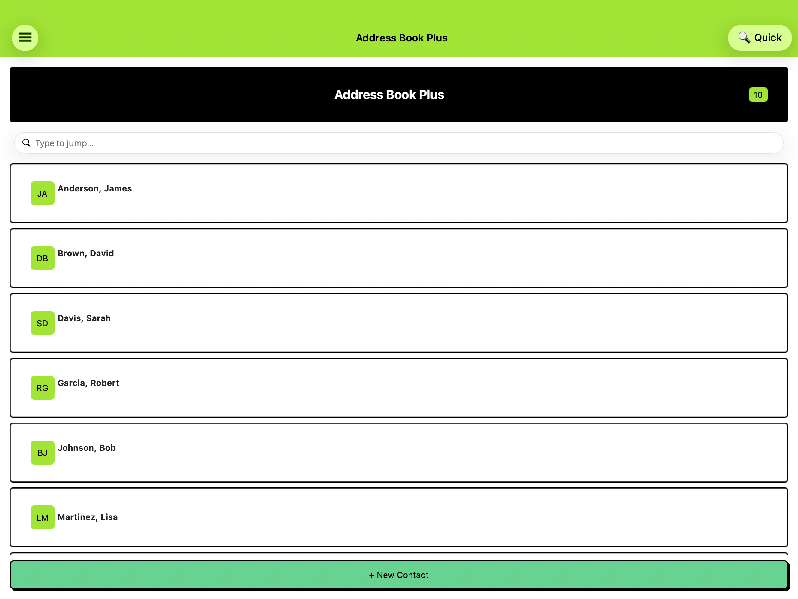
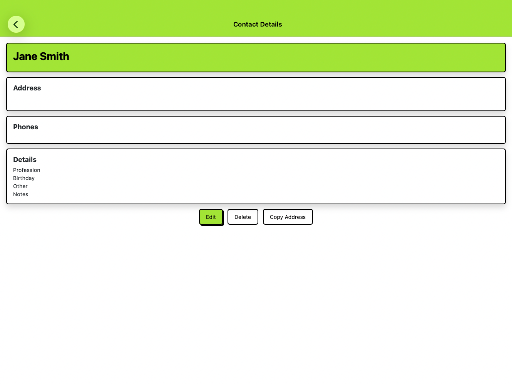
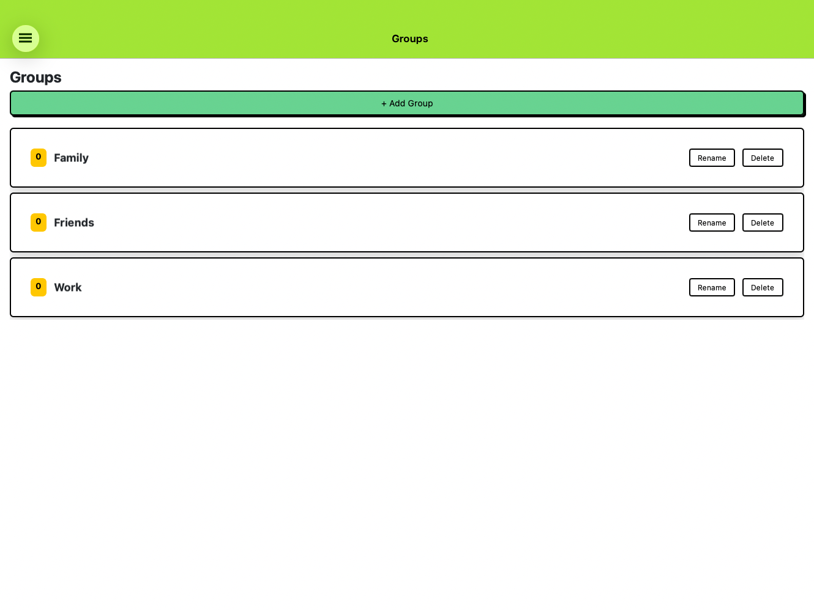
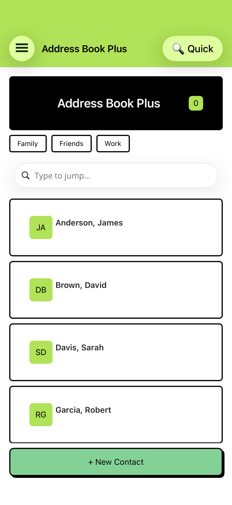
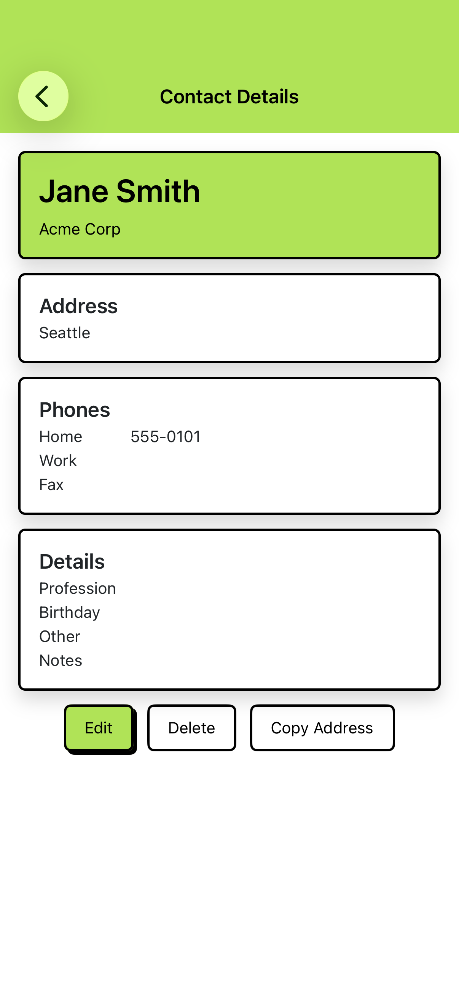
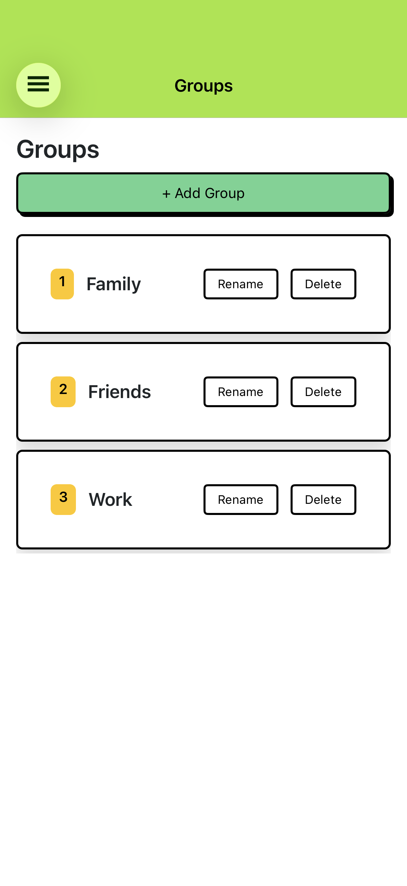
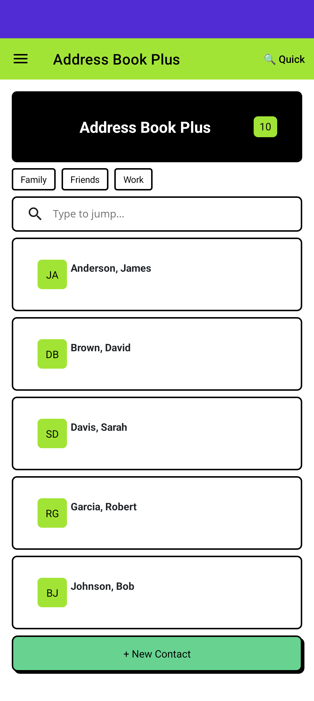
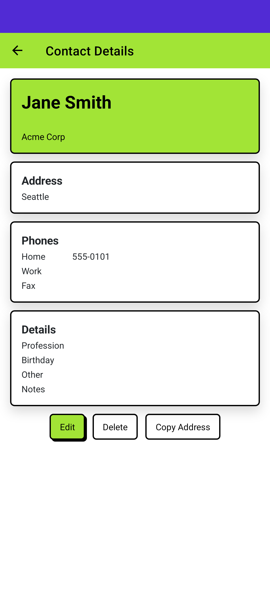
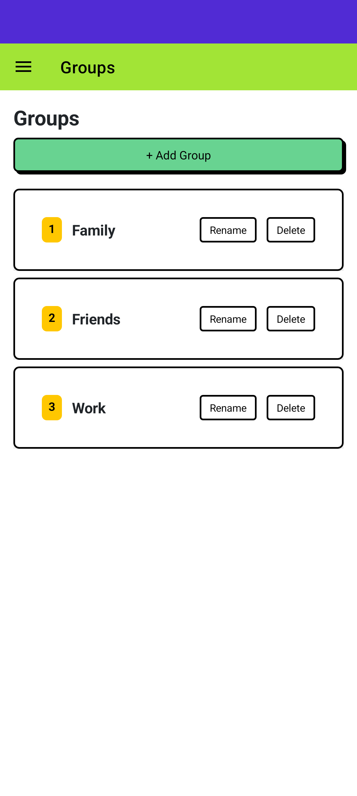

# Address Book Plus

A .NET MAUI recreation of the classic 1990 Apple Macintosh **Address Book Plus** — a retro card-based contact manager with modern cross-platform reach.

Built with the [Brite Bootswatch theme](https://bootswatch.com/brite/) via [Plugin.Maui.BootstrapTheme](https://www.nuget.org/packages/Plugin.Maui.BootstrapTheme) and [Bootstrap Icons](https://www.nuget.org/packages/IconFont.Maui.BootstrapIcons).

## Screenshots

### Mac Catalyst
| Contact List | Contact Detail | Groups |
|:---:|:---:|:---:|
|  |  |  |

### iOS
| Contact List | Contact Detail | Groups |
|:---:|:---:|:---:|
|  |  |  |

### Android
| Contact List | Contact Detail | Groups |
|:---:|:---:|:---:|
|  |  |  |

## Features

- **Contact management** — full CRUD with salutation, name, company, address, 3 phone numbers, profession, birthday, notes, and a user-definable custom field
- **Groups** — up to 9 renameable quick-access groups with contact membership management
- **Group filtering** — tap to filter contact list by group, tap again to clear (with visual selected state)
- **Type-to-jump search** — real-time filtering on the contact list
- **Full-text search** — dedicated search page across all contact fields
- **Mini Lookup overlay** — desk-accessory-style quick lookup from any page
- **Print templates** — binder full-page and phone list HTML templates
- **Import/Export** — vCard 3.0 and CSV support
- **Brite theme** — Bootswatch Brite lime green aesthetic with Bootstrap-styled controls
- **Bootstrap Icons** — vector icon font for flyout menu and toolbar

## Architecture

| Layer | Technology |
|-------|-----------|
| UI | XAML + Shell navigation |
| Pattern | MVVM with [CommunityToolkit.Mvvm](https://www.nuget.org/packages/CommunityToolkit.Mvvm) source generators |
| Data | SQLite via [sqlite-net-pcl](https://www.nuget.org/packages/sqlite-net-pcl) |
| Theme | [Plugin.Maui.BootstrapTheme](https://www.nuget.org/packages/Plugin.Maui.BootstrapTheme) 0.1.0-preview.5 |
| Icons | [IconFont.Maui.BootstrapIcons](https://www.nuget.org/packages/IconFont.Maui.BootstrapIcons) 1.0.0-preview.1 |
| Framework | .NET 10 / MAUI 10 |

## Getting Started

```bash
# Clone
git clone https://github.com/davidortinau/maui-addressbook.git
cd maui-addressbook

# Run on Mac Catalyst
dotnet build -f net10.0-maccatalyst -t:Run

# Run on iOS Simulator
dotnet build -f net10.0-ios -t:Run -p:_DeviceName=:v2:udid=<SIMULATOR_UDID>

# Run on Android Emulator
dotnet build -f net10.0-android -t:Run
```

Requires .NET 10 SDK and the MAUI workload (`dotnet workload install maui`).

## Project Structure

```
├── Models/              # PersonRecord, ContactGroup, GroupSelection
├── ViewModels/          # MVVM ViewModels with CommunityToolkit.Mvvm
├── Views/               # XAML pages + Controls/MiniLookupOverlay
├── Services/            # DataService (SQLite), SearchService, ImportExport, Print
├── Converters/          # Value converters
├── Resources/
│   ├── Themes/          # Brite Bootswatch CSS (processed at build)
│   ├── Fonts/           # Bootstrap Icons TTF
│   └── Raw/             # Print HTML templates
└── Platforms/           # Android, iOS, Mac Catalyst configs
```

## License

MIT
